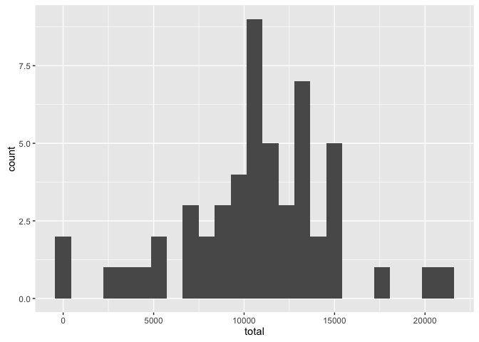
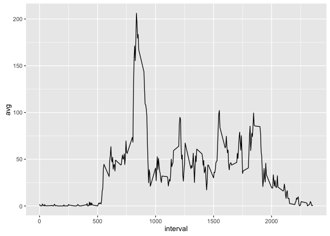
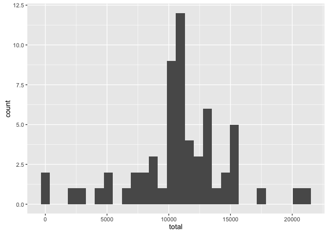
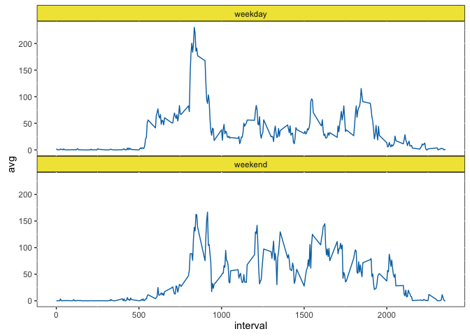

# Reproducible Research: Peer Assessment 1


## Loading and preprocessing the data

Import a few helpful utilities


```r
library(lubridate, warn.conflicts = FALSE)
library(ggplot2, warn.conflicts = FALSE)
library(dplyr, warn.conflicts = FALSE)
```

Load the data into a csv and parse the date


```r
activity <- read.csv("activity.csv") %>%
  transform(day=ymd(date))
```

## What is mean total number of steps taken per day?
  
Calculate the totals per day  
  

```r
totals_by_day <- activity %>%
  select(steps, day) %>%
  filter(!is.na(steps)) %>%
  group_by(day) %>%
  summarize(total=sum(steps))
```

Graph a histogram across days


```r
ggplot(totals_by_day) + 
  aes(x=total) + 
  geom_histogram(bins = 25)
```

<!-- -->

Calculate the mean and median in one call


```r
totals_by_day %>% summarize(mean=mean(total), median=median(total))
```

```
## Source: local data frame [1 x 2]
## 
##       mean median
##      (dbl)  (int)
## 1 10766.19  10765
```

## What is the average daily activity pattern?

Calculate the average by interval


```r
avg_by_interval <- activity %>%
  select(interval, steps) %>%
  filter(!is.na(steps)) %>%
  group_by(interval) %>% 
  summarize(avg=mean(steps))
```

Create a line graph


```r
ggplot(avg_by_interval) +
  aes(x=interval, y=avg) +
  geom_line()
```

<!-- -->

Pick out the max


```r
avg_by_interval %>% top_n(1, avg)
```

```
## Source: local data frame [1 x 2]
## 
##   interval      avg
##      (int)    (dbl)
## 1      835 206.1698
```

## Imputing missing values

Count the missing values


```r
activity %>% filter(is.na(steps)) %>% summarize(NAs=length(steps))
```

```
##    NAs
## 1 2304
```

Use the average by interval to fill missing values. Join the data then swap the values in.


```r
filled <- left_join(activity, avg_by_interval) %>%
   transform(steps=ifelse(is.na(steps),avg,steps))
```

```
## Joining by: "interval"
```

Calculate the totals with the filled values


```r
filled_total <- filled %>%
  select(steps, day, interval) %>%
  group_by(day) %>%
  summarize(total=sum(steps))
```

Graph the totals. Using the average pushes it up.


```r
ggplot(filled_total) + 
  aes(x=total) + 
  geom_histogram()
```

```
## `stat_bin()` using `bins = 30`. Pick better value with `binwidth`.
```

<!-- -->

Get the mean and the median. The mean is the same??? The median is pushed up.


```r
filled_total %>% summarize(mean=mean(total), median=median(total))
```

```
## Source: local data frame [1 x 2]
## 
##       mean   median
##      (dbl)    (dbl)
## 1 10766.19 10766.19
```

## Are there differences in activity patterns between weekdays and weekends?

Calculate the average using the filled data.


```r
filled_avg <- filled %>%
  select(interval, steps, day) %>%
  transform(part=ifelse(
    weekdays(day, abbreviate = TRUE) %in% c("Sun", "Sat"),
    "weekend", 
    "weekday")) %>%
  group_by(interval, part) %>% 
  summarize(avg=mean(steps))
```

Graph the data faceted by weekday vs weekend


```r
ggplot(filled_avg) +
    aes(x=interval, y=avg) +
    geom_line(color="#0072B2") +
    facet_wrap(~part, nrow = 2) + 
    theme(
      panel.margin=unit(0, "in"),
      panel.background=element_rect(fill="white", color="black"),
      strip.background=element_rect(fill="#F0E442", color="black"))
```

<!-- -->

